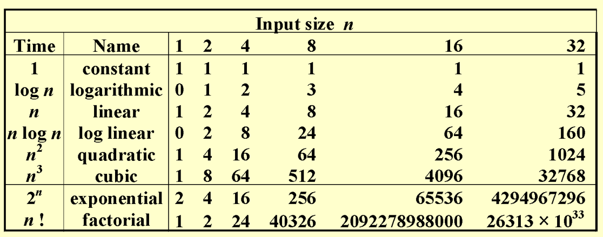
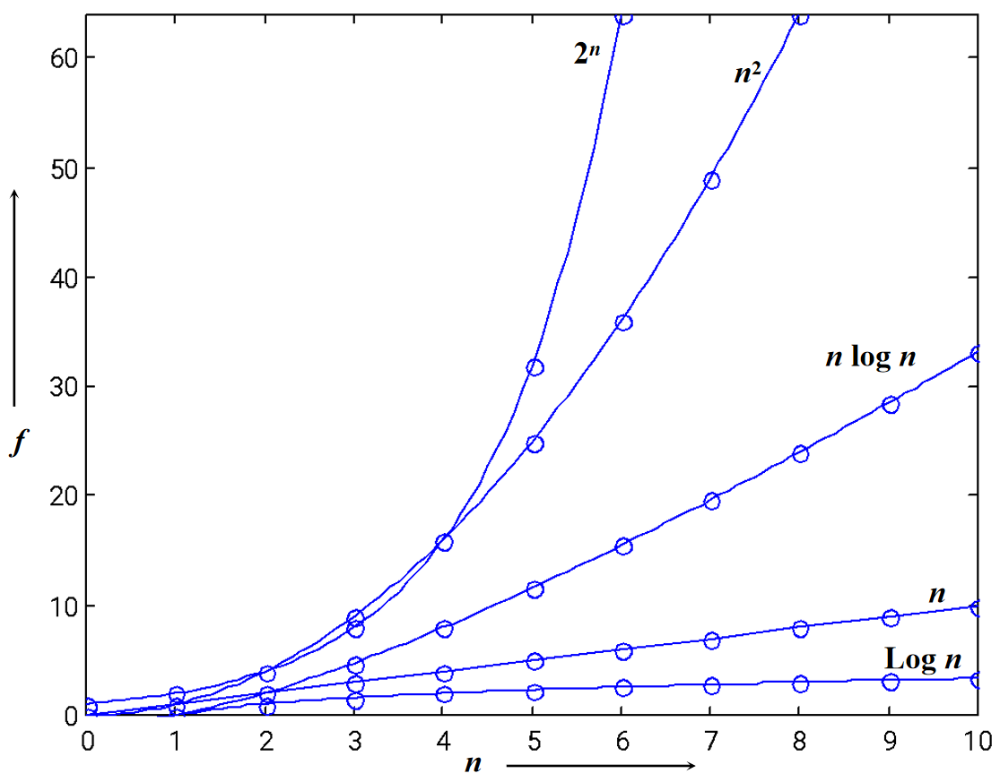
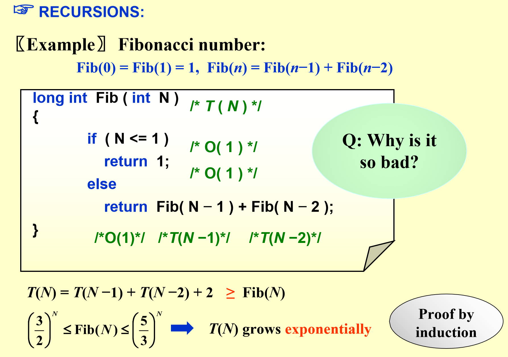

# Chapter 2 Algorithm Analysis

**算法(Algorithm)**：通过有限指令完成特定任务。所有的算法都具备以下特征：

+ *输入(Input)*：0个或多个输入
+ *输出(Output)*：**至少有1个**输出
+ *确定性(Definiteness)*：每条指令都是清楚的
+ *有限性(Finiteness)*：在所有情况下，算法在经过有限步后终止
+ *有效性(Effectiveness)*：每条指令足够简单可行，原则上使用纸和笔便能表达出来。

> 注：
>
> + **程序**由编程语言书写，并且不必是有限步，比如操作系统（的时钟）
> + **算法**能由以下方法描述：
> 	+ 人类语言*human languages*
> 	+ 流程图*flow charts*
> 	+ 编程语言*programming languages*
> 	+ 伪代码*pseudo-code*

## 1. What to Analyze

——Answer:  **Time & Space Complexities（时间&空间复杂度）**

在分析复杂度前，我们作出以下假设：

1. 每条指令按顺序执行
2. 每条指令**很简单**，且执行一条指令仅花费**一个时间单元**
3. 整数规模是固定的，并且我们有无限的内存

通常，我们分析下列两个函数，他们的输入规模均为$N$：

+ $T_{avg}(N)$：平均时间复杂度
+ :star2: $T_{worst}(N)$​​：最差时间复杂度

## 2. Asympotic Notation(渐进符号)

#### 定义

+ ==$T(N) = O(f(N))$==：存在正常数$c$和$n_0$，$\forall N \ge n_0$，都有$T(N) \le c \cdot f(N)$​

  > 一般取**最小**的$f(N)$，代表$T(N)$的**上界**。俗称“$Big-Oh$​”
  >
  > :heavy_exclamation_mark:*请忽略*大O阶里面的**常数项**和**低阶项**

+ $T(N) = \Omega(g(N))$ ：存在正常数$c$和$n_0$，$\forall N \ge n_0$，都有$T(N) \ge c \cdot g(N)$​

	> 一般取**最大**的$g(N)$，代表$T(N)$的**下界**

+ $T(N) = \Theta(h(N))$：当且仅当$T(N) = O(h(N))$ 且 $T(N) = \Omega(h(N))$

+ $T(N) = o(p(N))$：当$T(N) = O(p(N))$ 且 $T(N) \ne \Omega(p(N))$​

#### 规则

1. 如果$T_1(N) = O(f(N))$ 且 $T_2(N) = O(g(N))$ ，那么：
	+ $T_1(N) +T_2(N) = max(O(f(N)), O(g(N)))$
	+ $T_1(N) \cdot T_2(N) = O(f(N) \cdot g(N))$
2. 如果$T(N)$是$k$次多项式，那么$T(N) = \Theta(N^k)$
3. 对于任意常数$k$，$log^kN = O(N)$​。这说明==**对数**增长速度非常慢==

> 注：如果使用渐进符号比较两个程序的复杂度，确保$N$​​足够大

**增长速度图**





**Example**


> 注:
>
> 1. 注意内部循环的指令执行次数
>
> 2. 当$rows \text{ }\gg \text{ }cols$时，可考虑行列转置 
>
> 3. $T(rows, cols) = \Theta(rows \cdot cols)$

#### General Rules

+ **FOR LOOPS**：for 循环的运行时间<u>不超过</u>*“循环体内部语句 $\cross$ 迭代次数”*

+ **NESTED FOR LOOPS**：在一组嵌套循环内的一条语句的执行时间为*“该语句 $\cross$ 所有的for循环规模的乘积”*

+ **CONSECUTIVE STATEMENTS**：简单地*相加*起来（这意味着其中运行次数最多的一条语句最重要）

+ **IF / ELSE**：对于下面代码块

	``` c
	if (condition) S1;
	else S2
	```

	它的运行时间<u>不会超过</u>*“测试条件 + S1 和 S2 中运行时间的最长者”*

+ :exclamation: **RECURSION**

	
